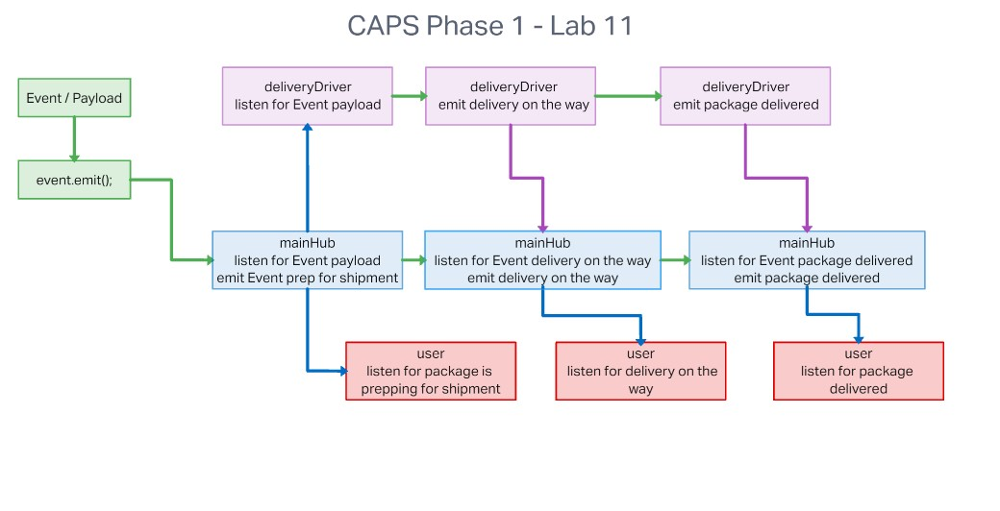
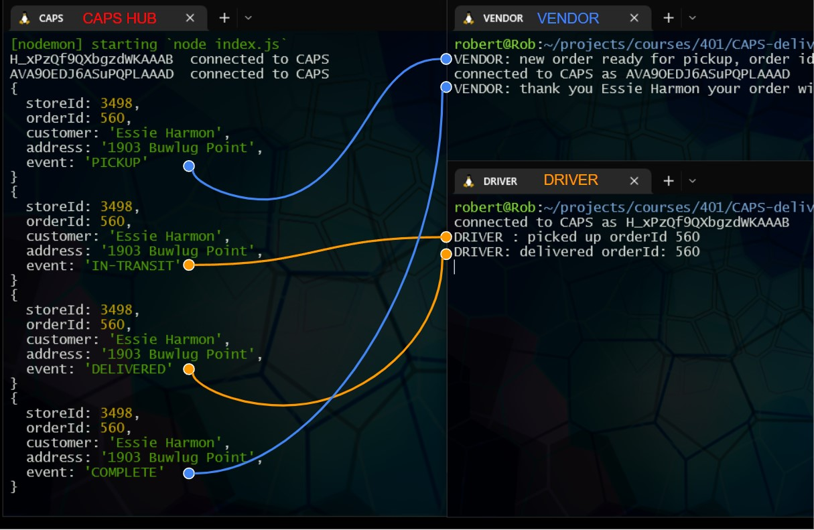

# CAPS-delivery-service

## Code 401d48 lab 11

## Author: Robert Ball

---

### Problem Domain

* In this first phase, our goal is to setup a pool of events and handler functions, with the intent being to refactor parts of the system throughout the week, but keep the handlers themselves largely the same. The task of “delivering a package” doesn’t change (the handler), even if the mechanism for triggering that task (the event) does.

<!-- Deployed production server: [Heroku - rb-ac lab09 API](https://rb-ac-lab-09.herokuapp.com/) -->

---
Requirements:

* The following user/developer stories detail the major functionality for this phase of the project.

  * As a vendor, I want to alert the system when I have a package to be picked up.
  * As a driver, I want to be notified when there is a package to be delivered.
  * As a driver, I want to alert the system when I have picked up a package and it is in transit.
  * As a driver, I want to alert the system when a package has been delivered.
  * As a vendor, I want to be notified when my package has been delivered.
* And as developers, here are some of the development stories that are relevant to the above.

  * As a developer, I want to use industry standards for managing the state of each package.
  * As a developer, I want to create an event driven system so that I can write code that happens in response to events, in real time.

---

Documentation:



---

## Phase 2 - Websocket | Sockit.io

* CAPS Phase 2: Continue working on a multi-day build of our delivery tracking system, creating an event observable over a network with Socket.io.

* In this phase, we’ll be moving away from using Node Events for managing a pool of events, instead refactoring to using the Socket.io libraries. This allows communication between Server and Client applications.

* The intent here is to build the data services that would drive a suite of applications where we can see pickups and deliveries in real-time.



Dependencies

```JSON
{
    "socket.io": "^4.5.2",
    "socket.io-client": "^4.5.2"
}
```

Setup

1. Create repo or fork this repo
2. Add README
3. Add .gitignore for Node
4. Add the license of your choice
5. Clone repo to your local system
6. with the repo open in your editor of choice, run:

```code
npm init -y
install dependencies
```
